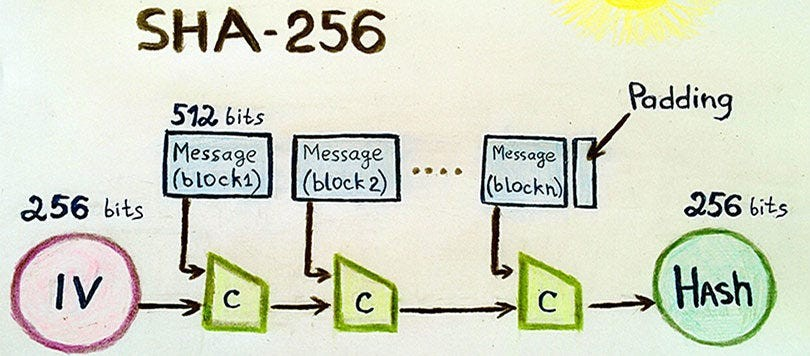
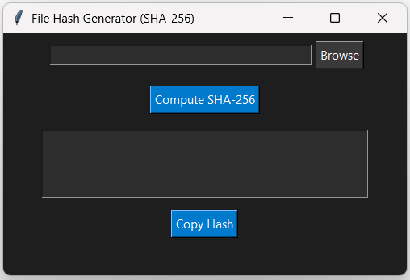
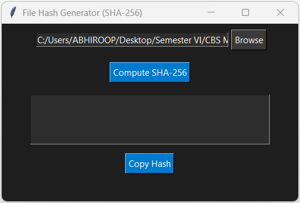
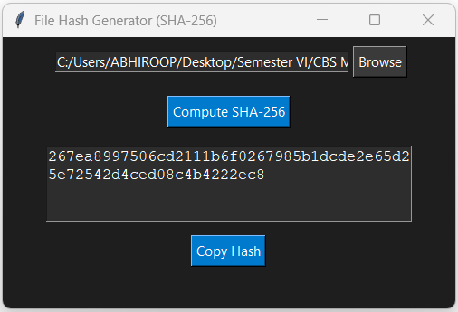

# GUI-Based File Hash Computation using SHA-256

## Introduction
This project presents a Graphical User Interface (GUI) application for computing the SHA-256 hash of any file. It is built using Python with the Tkinter library for GUI components and the `cryptography` library for hash computation. The application enables users to select a file, compute its SHA-256 hash, and copy the hash value to the clipboard for further use.

## SHA-256 Algorithm
SHA-256 (Secure Hash Algorithm 256-bit) is a cryptographic hash function that generates a 256-bit (32-byte) hash value. It is part of the SHA-2 family and is widely used in security applications such as digital signatures, password hashing, and blockchain technology. SHA-256 produces a unique fixed-size output for a given input, ensuring data integrity and authenticity.

 Image Sourced from LinkedIn [3]
### Properties of SHA-256:
- **Fixed Output Size:** Generates a 64-character hexadecimal string.
- **Deterministic:** The same input always results in the same output.
- **Fast Computation:** Efficient hashing for large data files.
- **Pre-image Resistance:** Difficult to reconstruct the original data from its hash.
- **Collision Resistance:** Low probability of different inputs producing the same hash.
### SHA-256 Architecture
SHA-256 operates on 512-bit blocks of data and processes them through multiple rounds of bitwise operations, modular additions, and logical functions. The architecture consists of:
1. **Message Padding:** The input message is padded to ensure its length is a multiple of 512 bits.
2. **Message Parsing:** The padded message is divided into 512-bit blocks.
3. **Message Expansion:** Each 512-bit block is expanded into 64 words of 32 bits each.
4. **Processing Rounds:** 64 rounds of processing are performed using a set of constant values and bitwise operations.
5. **Hash Value Computation:** The final hash value is obtained by combining the intermediate values after all rounds.
Each round uses bitwise logical operations (AND, OR, XOR), modular additions, and shift/rotate operations to transform the message blocks. These steps ensure that small changes in input produce significantly different hash values (avalanche effect).
## System Architecture
The application follows a simple client-side architecture where the user interacts with a GUI to select a file and compute its SHA-256 hash. The architecture consists of the following components:
1. **User Interface (UI):** Built using Tkinter, featuring buttons and text fields for user interaction.
2. **File Handling Module:** Uses `tkinter.filedialog` to browse and select files.
3. **SHA-256 Hashing Module:** Implements the `cryptography.hazmat.primitives.hashes` library to compute the SHA-256 hash.
4. **Clipboard Management:** Uses the `pyperclip` library to copy the hash value for convenience.
## Implementation
### Code 
```py
import tkinter as tk
from tkinter import filedialog, messagebox
import ctypes
from cryptography.hazmat.primitives import hashes
from cryptography.hazmat.backends import default_backend
import pyperclip  

def compute_sha256(file_path):
    try:
        sha256 = hashes.Hash(hashes.SHA256(), backend=default_backend())
        with open(file_path, "rb") as file:
            while chunk := file.read(4096):
                sha256.update(chunk)
        return sha256.finalize().hex()
    except Exception as e:
        return f"Error: {e}"

def select_file():
    file_path = filedialog.askopenfilename(title="Select a file")
    if file_path:
        entry_file_path.delete(0, tk.END)
        entry_file_path.insert(0, file_path)

def hash_file():
    file_path = entry_file_path.get()
    if not file_path:
        messagebox.showwarning("Warning", "Please select a file first!")
        return
    sha256_hash = compute_sha256(file_path)
    text_result.delete(1.0, tk.END)
    text_result.insert(tk.END, sha256_hash)
```

```py
def copy_to_clipboard():
    hash_text = text_result.get(1.0, tk.END).strip()
    if hash_text:
        pyperclip.copy(hash_text)
        messagebox.showinfo("Copied", "SHA-256 hash copied to clipboard!")

try:
    ctypes.windll.shcore.SetProcessDpiAwareness(1)  
except Exception:
    pass

root = tk.Tk()
root.title("File Hash Generator (SHA-256)")
root.geometry("500x300")
root.configure(bg="#1e1e1e")

frame = tk.Frame(root, bg="#1e1e1e")
frame.pack(pady=10)

entry_file_path = tk.Entry(frame, width=40, bg="#2d2d2d", fg="white", insertbackground="white")
entry_file_path.pack(side=tk.LEFT, padx=5)

btn_browse = tk.Button(frame, text="Browse", command=select_file, bg="#3a3a3a", fg="white")
btn_browse.pack(side=tk.LEFT)

btn_hash = tk.Button(root, text="Compute SHA-256", command=hash_file, bg="#007acc", fg="white")
btn_hash.pack(pady=10)

text_result = tk.Text(root, height=4, width=40, wrap=tk.WORD, bg="#2d2d2d", fg="white", 
insertbackground="white")
text_result.pack(pady=10)

btn_copy = tk.Button(root, text="Copy Hash", command=copy_to_clipboard, bg="#007acc", fg="white")
btn_copy.pack(pady=5)

root.mainloop()
```
The Python script implements the following functionalities:
- **Compute SHA-256 Hash:** Reads the file in chunks of 4096 bytes and updates the hash incrementally.
- **GUI Components:**
  - File selection using `tkinter.filedialog.askopenfilename()`.
  - Text box to display the computed hash.
  - Buttons to trigger file selection, hash computation, and copying to clipboard.
- **Clipboard Functionality:** Uses `pyperclip.copy()` to store the hash value.
- **DPI Awareness:** Enhances display quality on high-resolution screens using `ctypes.windll.shcore.SetProcessDpiAwareness(1)`.

## Working






### Steps to Use:
1. Run the Python script.
2. Click the "Browse" button and select a file.
3. Click "Compute SHA-256" to generate the hash.
4. Copy the hash using the "Copy Hash" button.

## Conclusion
This project provides a simple and effective solution for generating SHA-256 hashes of files. It ensures data integrity and security through cryptographic hashing, making it useful for verifying file authenticity and detecting modifications. Future improvements may include support for additional hash algorithms (e.g., SHA-1, MD5) and drag-and-drop file selection.


## References
1. Wikipedia contributors. (n.d.). *SHA-2*. Wikipedia, The Free Encyclopedia. Retrieved March 26, 2025, from [https://en.wikipedia.org/wiki/SHA-2](https://en.wikipedia.org/wiki/SHA-2)  
2. PyCA. (n.d.). *Cryptography library*. GitHub. Retrieved March 26, 2025, from [https://github.com/pyca/cryptography](https://github.com/pyca/cryptography)  
3. The Daily Thoth Newsletter, *A beginner’s guide to understanding the SHA-256 algorithm*. LinkedIn. Retrieved March 26, 2025, from [https://www.linkedin.com/pulse/beginners-guide-understanding-sha-256-algorithm-the-daily-thoth-viohe/](https://www.linkedin.com/pulse/beginners-guide-understanding-sha-256-algorithm-the-daily-thoth-viohe/)  
